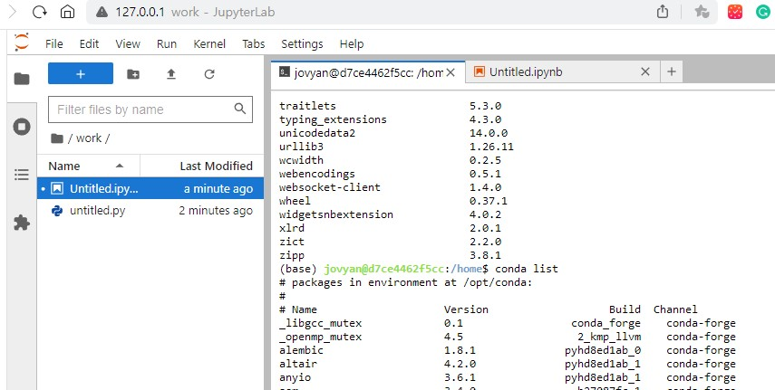
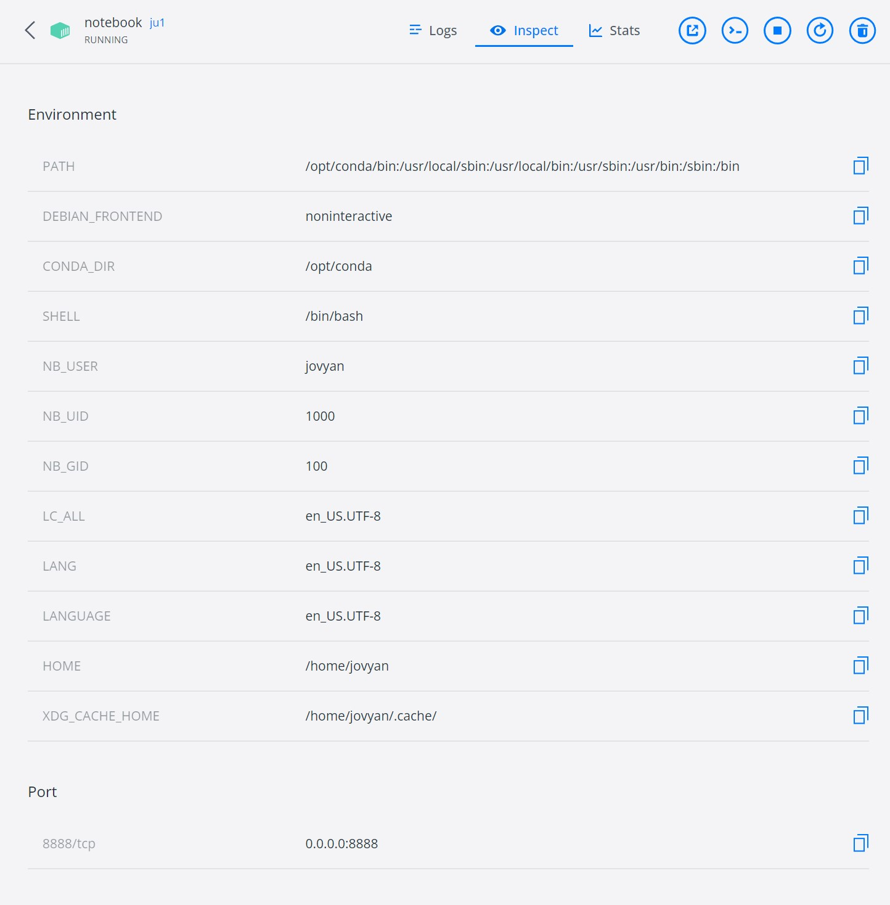

Jupyter image Info
- [Jupyter Docker Stacks](https://jupyter-docker-stacks.readthedocs.io/en/latest/index.html)  
- [jupyter/scipy-notebook:latest image layers](https://hub.docker.com/layers/jupyter/scipy-notebook/latest/images/sha256-dc39d15bddf8d49d3308d000be34540b0273f8049d481a61aad6b2c535489bdd?context=explore)

Build an image
```bash
docker build -t image_name
```

Run a container
```bash
docker run -it -p 8888:8888 --name container_name image_name
```



